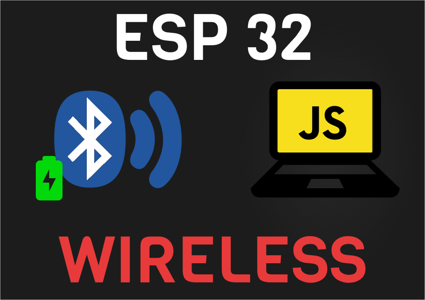
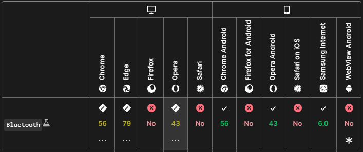
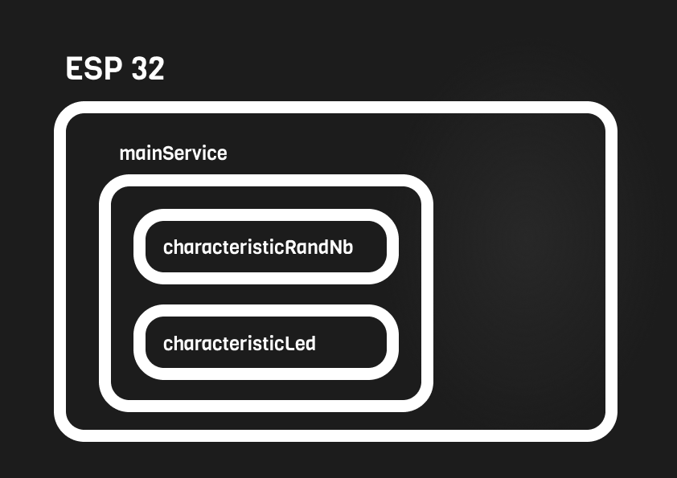
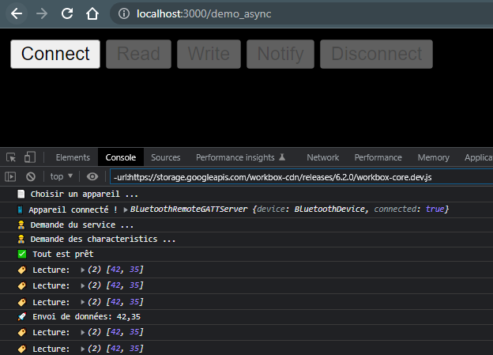

# [js-ble-esp32](https://qypol342.github.io/js-ble-esp32/index2.html)

## Objectif
L’objectif de ce projet est d’avoir le code minimum pour communiquer avec esp32 avec du Bluetooth BLE depuis son navigateur. Parce que le projet se repose sur le navigateur cela fonctionne aussi sur mobile.

## Attention
L’api Bluetooth n’est pas encore supporté par  beaucoup de navigateurs. Pour l’instant seuls les navigateurs avec le moteur Chromium sont compatibles.

## Prérequis
Vous avez besoin d’un Esp32 évidemment, de l’IDE Arduino pour téléverser le code et finalement d’un serveur web (dans mon cas j’ai utiliser npm avec la commande `npx serve`)

## Installation
Cloner le projet sur votre machine  
Téléverser le `.ino` sur votre Esp32  
Assurez vous que le chemin du serveur web correspond bien à la racine de ce projet
Lancer votre serveur web ( exemple `npx serve` )

## Bluetooth BLE structure
Le protocole fonctionne avec des services et des caractéristiques. Cette structure est très similaire à celle d’une bibliothèque, les services sont des étagères, on y range donc les livres des mêmes auteurs et du même genre. Les caractéristiques sont comme des livres on les ranges dans les mêmes services si il propose le même type de donnée ou que les données ont le même objectif.

Voici la structure créée dans ce projet:

Dans cette exemple `characteristicRandNb` est un seul octet, alors que `characteristicLed` est un table de 2 octets.

## Utilisation
Un fois la page web chargée et l'Esp 32 alimenté, cliquez sur `connect`, si votre navigateur est compatible un petit page va soucrir où vous allez pouvoir choisir l'appareil.
Une fois l'appareil choisi et la connexion réussit les autres boutons sont activés. Avec le bouton `Read` vous pouvez lire `characteristicLed` qui est un tableau de 2 octets. Avec le bouton `Write` vous pouvez écrire sur `characteristicLed`. Le code envoyé lorsque vous cliquez sur `Write` change entre ces deux tableaux: Une fois [42, 35] un fois [42,2].  
Dans le code de l’arduino si le deuxième élément du tableau est un 2 alors la LED s’allume. Pour confirmer cet événement, il change la première valeur du tableau, il la met à 23. L'Esp 32 va a chaque révolution modifier la valeur de `characteristicRandNb` avec un nombre aléatoire compris entre 0 et 11.  
Avec le bouton `Notify` sur la page web vous pouvez vous abonner au changement de valeur. A chaque changement, la nouvelle valeur sera affichée dans la console. 
Finalement le bouton `Disconnect` qui parle de lui-même permet de déconnecter l'appareil. Dans cette configuration l'Esp 32 peut être connecté à un seul appareil à la fois.

## Documentation

[Librairie arduino BLE](https://www.arduino.cc/reference/en/libraries/arduinoble/)

[Google BLE Guide](https://developer.chrome.com/articles/bluetooth/)

## Data needed

- datetime
- door status 1 byte
- winter time 1 byte
- light sensor value (more than 4 (254))

## guide Fr
- dans cette demo on aura un seul service avec 2 char
- un qui premt de génré la led de esp32 avec qui peut recevoi 2 octec
- un qui sera en lecture seul mais pour le quel on mettre un lsitenser qui observe si la valeur change commé d'un seul octer
- crée le fichier html
- ajouter la structure de base d'un fichier html
- ajouter 5 button
- pour se co pour lire pour ecrit pour etre notifier et se deco
- definir les bouton dans le js
- definir les uuid des service
- ajouter de vaiable
- ajouter les liseneter quand onc lcike sur les boutotn
- desactiver les bouton tant qu'uaun apparail est connecter
- fonction se connecter
- verfiifer si le navigateur est compatible
- fonction pour la demande d'appapreil
- fonction connecter se conncter
- demande le service
- aperis du service demander la charcherteroistique que l'on soug=haite
- activer les bouton
- fonction read pour la char led
- fonction écritre pour le char led
- fonction notify echoute chengemenat
- deconneciton

- code arduino

