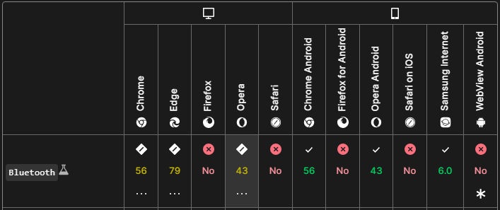
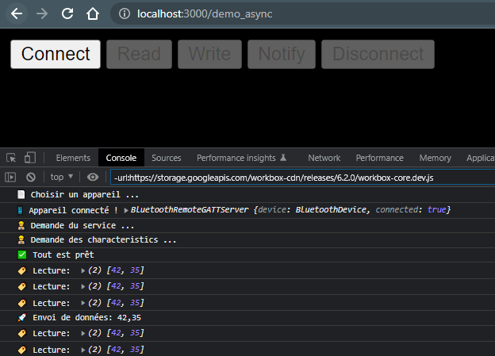

# [js-ble-esp32](https://qypol342.github.io/js-ble-esp32/index2.html)

### [Change language 🇫🇷](README.md)

# 🎯 Objective
The goal of this project is to have the minimum code to communicate with esp32 using Bluetooth BLE from the browser. Since the project relies on the browser, it also works on mobile.

# ⚠️ Warning
The Bluetooth API is not yet supported by many browsers. Currently, only browsers with the Chromium engine are compatible.

# 👉 Prerequisites
You need an Esp32, the Arduino IDE to upload the code, and finally a web server (in my case I used npm with the command `npx serve`)

# 📋 Installation
Clone the project on your machine  
Upload the `.ino` to your Esp32  
Make sure the web server path corresponds to the root of this project
Start your web server (example `npx serve`)

# 📐 Bluetooth BLE structure
The protocol works with services and characteristics. This structure is very similar to a library, services are shelves, so books from the same authors and the same genre are stored. Characteristics are like books, they are stored in the same services if they offer the same type of data or the data has the same purpose.

Here is the structure created in this project:

In this example, `characteristicRandNb` is one byte, while `characteristicLed` is a 2-byte table.

# 🚀 Usage
Once the web page is loaded and the Esp 32 is powered, click on `Connect`, if your browser is compatible a small page will open where you can choose the device.
Once the device is chosen and the connection is successful, the other buttons are enabled. With the `Read` button you can read `characteristicLed`, which is a 2-byte array. With the `Write` button you can write to `characteristicLed`. The code sent when you click on `Write` changes between these two arrays: one time [42, 35], one time [42,2].  
In the Arduino code, if the second element of the array is 2, then the LED lights up. To confirm this event, it changes the first value of the array, it sets it to 23. The Esp 32 will modify the value of `characteristicRandNb` with a random number between 0 and 11 on each revolution.  
With the `Notify` button on the web page, you can subscribe to value changes. Every time the value changes, the new value will be displayed in the console. 
Finally, the button `Disconnect`, which speaks for itself, allows you to disconnect the device. In this configuration, the Esp 32 can be connected to only one device at a time.

# 📚 Documentation

[Librairie arduino BLE](https://www.arduino.cc/reference/en/libraries/arduinoble/)

[Google BLE Guide](https://developer.chrome.com/articles/bluetooth/)

